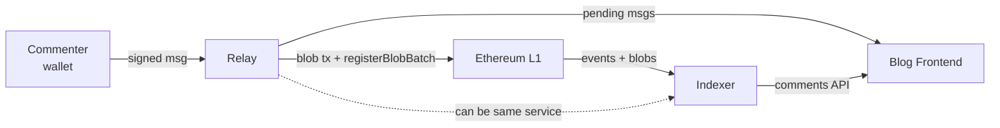
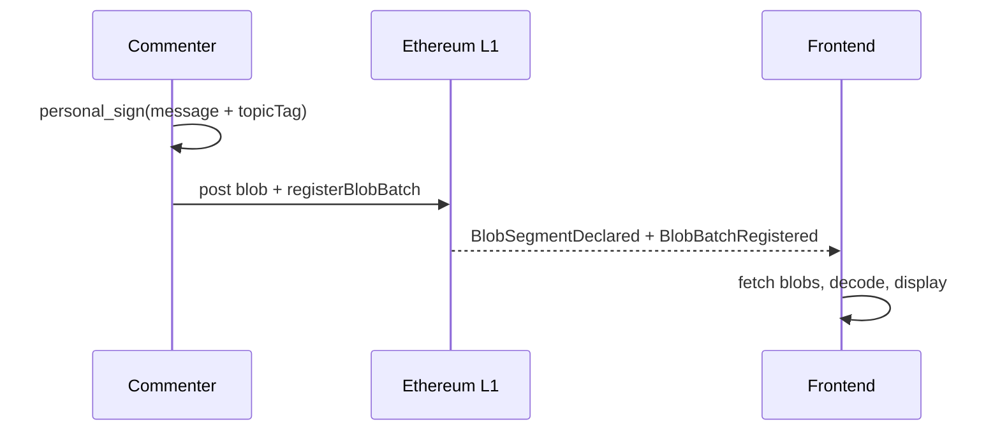

# On-chain blog comment section

An on-chain comment system for a blog, with everything on L1 and decentralized moderation.

This doc covers the reading and writing infrastructure: how comments get authored, batched, posted, indexed, and displayed. Content moderation is a separate problem (TBD below).

## Architecture

Built on BAM (Blob Authenticated Messaging), using the `BlobAuthenticatedMessagingCore` contract (ERC-8179/8180). Comments are signed with `personal_sign` (ECDSA) using the ERC-8180 signing domain (`keccak256(abi.encodePacked("ERC-BAM.v1", chainId))`) so users can just use their existing wallet. BLS aggregation could be added later if volume justifies the UX cost.

### System overview

### Posting flow (happy path)

### Fallback flow (no server)

### Actors

- **Commenter** signs messages (including the topic tag) with their wallet via `personal_sign` (ECDSA) using the ERC-8180 signing domain. No key registration needed. The topic is bound to the signature, so a relay cannot repost a comment under a different blog post.
- **Relay** accepts signed messages, batches them into blobs, posts to L1 via `registerBlobBatch()` with a `contentTag` matching the topic. Untrusted: it can censor or delay, but can't forge anything because messages are pre-signed and topic-bound. Anyone can run one.
- **Indexer** watches `BlobSegmentDeclared` events (filtered by `contentTag`) and joins with `BlobBatchRegistered` events (by `versionedHash`) to discover the batch's `decoder` and `signatureRegistry`. Fetches blobs, decodes, verifies signatures, and serves comment history via API. Can be the same service as the relay. Also untrusted: it can omit comments but can't forge them.
- **Blog frontend** displays comments. Two modes: query the server (fast) or self-index from chain (slow, expensive, but works without any infrastructure).

### Operating modes

The server is the fast path. The frontend fallback exists so the system doesn't hard-depend on anyone's infrastructure.

**With server (fast path):**
1. Commenter signs a message with `personal_sign`, including the blog post topic tag in the signed payload
2. Submits to a relay
3. Relay serves the message immediately as "pending" via API
4. Relay batches pending messages, posts a blob tx, and calls
   `registerBlobBatch(blobIndex, startFE, endFE, contentTag, decoder, signatureRegistry)` where
   `contentTag = keccak256(topicId)`, `decoder` is the BAM message decoder deployed for this
   protocol, `signatureRegistry` is the ECDSA registry (per ERC-8180), and
   `(blobIndex, startFE, endFE)` addresses the segment inside the posted blob (for a relay that
   fills a whole blob per batch, `(0, 0, 4096)`; for partial blobs the relay tracks its own
   segment cursor)
5. Indexer (can be the same service) watches `BlobSegmentDeclared` events filtered by `contentTag`, joins with `BlobBatchRegistered` for decoder/registry lookup, fetches/decodes blobs, serves comment history
6. Frontend queries the indexer for confirmed comments and the relay for pending ones

**Without server (escape hatch, not a primary UX):**
1. Commenter signs a message with their wallet, including the topic tag
2. Commenter posts a blob and calls
   `registerBlobBatch(0, 0, 4096, contentTag, decoder, signatureRegistry)` directly — one comment
   per blob (full-blob segment), with the same `decoder` and `signatureRegistry` the indexers
   expect for this protocol (roughly $1-5 at current blob gas prices)
3. Frontend scans `BlobSegmentDeclared` events by `contentTag`, joins with `BlobBatchRegistered` for decoder lookup, and fetches blobs from the Beacon API or archivers
4. Works, but too expensive for regular use

### On-chain exposure

Not needed in the happy path. Comments are read by decoding blobs off-chain.

Whether on-chain exposure is needed depends on the moderation design (TBD). KZG exposure requires per-message field element alignment in the blob, which constrains compression and reduces how many comments fit per blob. If moderation can work without exposure, blobs can be compressed more aggressively.

### Relay design

The relay's trust model is liveness only. It can't forge signatures, only censor or delay.

Multiple relays can operate for the same blog. If one censors or goes down, commenters resubmit to another. Relays serve queued messages via API before they're batched into a blob. Signatures are verifiable client-side, so pending comments are already authenticated, just not yet committed to chain.

Optionally, relays can gossip pending messages to each other so any relay can batch them.

### Topic routing

Topics are identified by a `bytes32 contentTag` (e.g., `keccak256(blogPostUrl)`). This tag appears in two places:

1. **In the signed message**: the topic is included in the commenter's signed payload, binding the comment to a specific blog post. A relay cannot reattribute a comment to a different topic without invalidating the signature.
2. **On-chain**: relays pass the same `contentTag` to `registerBlobBatch()`, which emits it as an indexed field in `BlobSegmentDeclared`. Indexers filter events by `contentTag` to find relevant blobs efficiently via indexed logs.

### Blob archival

Blobs get pruned from the Beacon chain after ~18 days. A few ways to keep them around:

- Relays archive blobs as a side effect of posting them
- The blog frontend pins blobs to IPFS as it reads them (readers become archivers)
- Third-party blob archivers (Blobscan, EthStorage)

Multiple relays means multiple archives.

### Nonce enforcement and deduplication

Per ERC-8180 nonce semantics, indexers and frontends MUST:

- Track `lastAcceptedNonce[author]` per sender and reject messages where `nonce <= lastAcceptedNonce`
- De-duplicate by `messageId` (`keccak256(abi.encodePacked(author, nonce, contentHash))`)

This ensures independent indexers converge on the same state and prevents relay replay attacks.

### Pending message edge cases

- Message stays pending too long: frontend flags it, commenter can resubmit to another relay
- Relay goes down before batching: commenter still has their signed message, resubmits elsewhere
- Duplicate submission across relays: dedup by `messageId`

## Content moderation

TBD. The requirements: decentralized (blog author doesn't want to moderate), high quality discussion, offense/defense asymmetry favoring defense. Kleros is a candidate. This design will also determine whether on-chain exposure is needed (see above).

## Existing BAM infrastructure

| Component | Role |
|---|---|
| `BlobAuthenticatedMessagingCore` | Blob registration with indexed `contentTag` for topic routing (ERC-8179/8180) |
| `bam-sdk` | Message encoding, signing, blob construction |

## Assumptions

Infrastructure:
- Blob gas stays cheap enough for comment batching to be viable
- Beacon API is accessible and reliable enough for the frontend fallback
- 280-character default message limit works for blog comments (configurable, wire format supports up to 65535 bytes)

Trust model:
- Nonce in message format prevents relay replay attacks (indexers enforce per-sender monotonic nonces per ERC-8180)
- Dedup by `messageId` is sufficient, and independent indexers will converge on the same state
- Topic tag is included in the signed payload, so relays cannot misattribute comments across topics
- `contentTag` in `registerBlobBatch()` needs no access control (anyone can tag any topic, but the signed topic in the message is authoritative)

Lifecycle:
- 18-day blob pruning window is long enough for at least one archiver to grab the data
- Fallback mode (one comment per blob) is usable as an escape hatch, if expensive

Moderation:
- Content moderation can be layered on after the base protocol ships, without needing to change the registration flow

## Open questions

Upstream (impacts BAM SDK):
- The 280-character message limit (`MAX_CONTENT_CHARS`) is now configurable via `encodeMessage()` options. The SDK already supports >255-byte content by auto-setting `FLAG_COMPRESSED` and switching to a uint16 length encoding. Note: `FLAG_COMPRESSED` is overloaded — it currently signals "extended content length" rather than actual compression. This naming should be cleaned up.
- The message hash (`computeMessageHash`) does not currently include a topic field. A new field (e.g., `bytes32 topicTag`) needs to be added to the signed payload so that comments are cryptographically bound to a specific blog post.
- Topic routing has no spam protection. Anyone can tag junk blobs for any topic via `registerBlobBatch()`. Should filtering happen at the contract level or application level?

This spec:
- Topic ID format: blog post URL hash vs. sequential ID vs. something else
- Relay incentives: do commenters pay a small fee, or is relay operation altruistic/self-hosted?
- Archival guarantees: is relay-side archival enough, or do we need an explicit DA commitment?
- Moderation contract design (see above)
- Identity/reputation: ENS integration? Any signal beyond raw addresses?
- Threading: how does the message format handle replies and parent references?
- Cost analysis: per-comment cost at different volumes, sensitivity to blob gas prices. Needs a worked example at a specific snapshot (blob gas price, comments per blob, ETH price)
