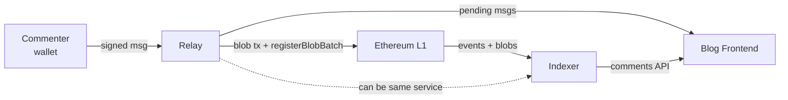
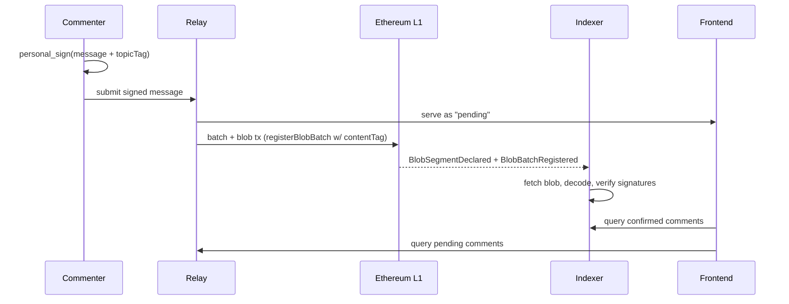
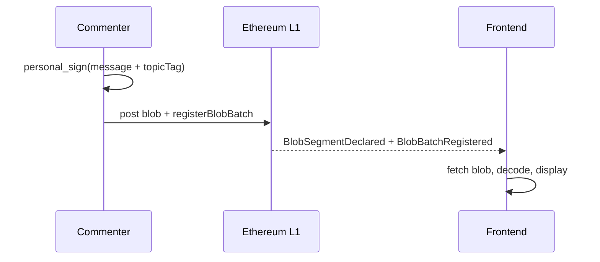

# On-chain blog comment section

An on-chain comment system for a blog, built on BAM (Blob Authenticated Messaging, ERC-8179/8180). This doc sketches the architecture — how comments get authored, batched, posted, indexed, and displayed. Content moderation and cost analysis are deferred.

## Status

This is a design sketch, not a spec. Several primitives the design assumes are not yet present in this repo — see **Prerequisites** below. Where the doc describes concrete behavior ("the relay does X"), it's describing what the system would do assuming those prerequisites land. Where a decision is deliberately left open, it's called out as an open question.

## Architecture

The intended signing flow is `personal_sign` (ECDSA) over the ERC-8180 domain-separated message hash (`keccak256(domain || messageHash)` where `domain = keccak256("ERC-BAM.v1" || chainId)`), so commenters can use their existing wallet and signatures aren't replayable across chains. The current SDK applies EIP-191 `personal_sign` directly to the message hash without the domain wrap, so domain separation needs to land in the SDK first — see Prerequisites #5. BLS aggregation could be added later if volume justifies the UX cost.

### System overview

### Posting flow (happy path)

### Fallback flow (no server)

### Actors

- **Commenter** signs messages with `personal_sign` (ECDSA). Includes the blog-post topic in the signed payload so a relay can't reattribute the comment to another post. (Topic binding depends on an upstream SDK change — see Prerequisites.)
- **Relay** accepts signed messages, batches them into blobs, and submits to L1 via the core contract's `registerBlobBatch`. Untrusted: it can censor or delay, but can't forge — messages are pre-signed. Anyone can run one.
- **Indexer** watches `BlobSegmentDeclared` events (filtered by `contentTag`) and joins with `BlobBatchRegistered` to discover the batch's `decoder` and `signatureRegistry`. Fetches blobs, decodes via the decoder, verifies signatures, and serves comment history via API. Untrusted: can omit but not forge. Often the same service as the relay.
- **Blog frontend** displays comments. Queries the indexer for confirmed comments and the relay for pending ones. Can fall back to scanning events directly if no indexer is available.

### Operating modes

The server (relay + indexer as one service) is the primary path. A self-index fallback exists so the system doesn't hard-depend on third-party infrastructure.

**With a server:**
1. Commenter signs the message (including topic) and submits to a relay.
2. Relay serves it as "pending" while queuing for the next blob.
3. Relay submits a single EIP-4844 transaction that posts the blob(s) and calls the core's `registerBlobBatch`, tagged with the topic's `contentTag`. See ERC-8180 / `IERC_BAM_Core` for the exact interface. The blob(s) and the register call must be in the same transaction — the core reads blob hashes via `BLOBHASH`, which only returns hashes for blobs attached to the current tx (per ERC-8179).
4. Indexer sees `BlobSegmentDeclared` (for `contentTag`) and `BlobBatchRegistered` (for decoder/signature-registry), fetches the blob, decodes, verifies, and exposes confirmed comments.
5. Frontend merges the confirmed (indexer) and pending (relay) views.

**Without a server (escape hatch, expensive — roughly $1–5 per comment at current blob gas):**
1. Commenter submits a single EIP-4844 tx with a one-comment blob and a `registerBlobBatch` call tagging the topic.
2. Frontend scans events by `contentTag`, joins with `BlobBatchRegistered` for decoder lookup, and reads the blob from the Beacon API or an archiver.

### Relay design

The relay's trust surface is liveness only. Multiple relays can operate concurrently for the same blog; if one censors or drops, commenters resubmit elsewhere. Signed messages are client-verifiable, so pending comments are already authenticated — they just aren't committed to chain yet. Relays may optionally gossip pending messages to each other so any relay can batch them.

### Topic routing

Topics use a `bytes32 contentTag` (e.g., `keccak256(blogPostUrl)`). The tag appears in two places:

- **In the signed message** — binding the comment to a specific post so it can't be reattributed (depends on Prerequisites #1).
- **On-chain** — as the indexed `contentTag` field in `BlobSegmentDeclared`, so indexers can filter via indexed logs.

Topic spam is currently unprotected: anyone can tag junk blobs for any topic. Whether to filter at the contract level or the application level is an open question.

### Blob archival

Blobs are pruned from the Beacon chain after ~18 days. Archival options:

- Relays archive blobs as a side effect of posting them.
- Frontends pin blobs to IPFS as they read (readers become archivers).
- Third-party archivers (Blobscan, EthStorage).

With multiple relays, there are multiple archives by default.

### Ordering and deduplication

**Deduplication.** The natural dedup key is the hash the commenter signed over — any two views of the same signed message produce the same hash, whether the message is pending or confirmed. This key is also stable across indexers, so independent indexers converge on the same comment set regardless of the order in which messages arrive.

Until the SDK includes the topic in `computeMessageHash` (Prerequisites #1), a signed message's hash is independent of the topic it's submitted under. An adversary — or a malfunctioning relay — could take a valid signed comment and re-submit the identical bytes under a different `contentTag`; both submissions would share the same hash, so a hash-only dedup key would count the duplicate as the original. Indexers therefore scope the dedup key by topic externally — e.g., `(topicTag, computeMessageHash(msg))` — as an interim convention. Once the upstream change lands and the topic is part of the signed hash, the external scoping becomes redundant.

**Ordering.** Confirmed comments are ordered by their on-chain event order: `(block number, log index)` of the `BlobBatchRegistered` event that registered the containing batch, plus intra-batch position from the decoder. Two indexers with the same chain view and the same decoder agree on this order. Pending comments are ordered by whatever the relay served them in; this is advisory, not authoritative — when a pending message confirms, it takes its place in the confirmed order.

The message's `timestamp` field is author-signed and therefore author-controlled; it is **not** used as an ordering source. At most, frontends can surface it to readers as author-declared metadata ("posted on …") distinct from the canonical order.

**Nonces.** Nonces are part of the signed payload (ERC-8180 binds them into the message hash) so a signature can't be reused under a different nonce. This system does not enforce the "reject messages whose nonce does not exceed the sender's last-accepted nonce" rule that ERC-8180 §"Nonce Semantics" allows clients to apply: comments arrive asynchronously, and an indexer seeing nonce 3 before nonce 2 should not drop nonce 2 when it later arrives. Dedup by message hash already handles replay; enforcing nonce strictness would only produce divergent indexer state.

### On-chain exposure

Not needed in the happy path — comments are read by decoding blobs off-chain. On-chain exposure (e.g., an ERC-8180 exposer) would only become necessary if a downstream moderation contract needs to prove a specific message exists in a batch on-chain. That's a downstream decision, tied to Content moderation.

### Pending message edge cases

- Message stays pending too long: frontend flags it; commenter can resubmit to another relay.
- Relay goes down before batching: the commenter still has their signed message and can resubmit elsewhere.
- Duplicate submission across relays: dedup by message hash (see Ordering and deduplication).

## Content moderation

TBD. Requirements: decentralized (the blog author doesn't want to moderate), quality discussion, defense-favored asymmetry. Kleros is one candidate. This design will also determine whether on-chain exposure is needed.

## Prerequisites

The design above relies on a few things that don't exist in this repo as of writing. Each is called out so the doc's concrete claims stay tethered to what needs to change for them to hold.

1. **Topic in the signed message hash.** `bam-sdk`'s `computeMessageHash` currently hashes `(author, timestamp, nonce, content, flags)` with no topic field. A `bytes32 topicTag` (or equivalent) needs to be added to the encoding and included in the signed hash so topic binding is enforced by the signature rather than by indexer convention. Until then, topic binding is only an indexer-side rule, and dedup has to scope by topic externally — see Ordering and deduplication.

2. **Canonical `messageId` definition.** ERC-8180 defines `messageId = keccak256(author, nonce, contentHash)` where `contentHash` is the *batch* identifier (blob versioned hash or `keccak256(batchData)`). The SDK's `computeMessageId` currently returns the hex of `computeMessageHash` — the per-message hash, no batch identifier — so the SDK helper and the spec disagree. The SDK needs either a rename (to something like `computeMessageHashHex`) or an additional helper of the form `computeMessageId(msg, batchContentHash)`.

3. **Signature verification story for ECDSA.** ERC-8180 §"Signature Registry Interface" permits ECDSA registries to verify via `ecrecover` without per-address key registration ("keyless verification"). No such registry is deployed in this repo — only `BLSRegistry.sol`. Two options to resolve before deployment:
   - Deploy a minimal keyless-ECDSA registry so every `registerBlobBatch` call names a real registry, keeping the batches interoperable with generic ERC-8180 tooling.
   - Pass `signatureRegistry = address(0)` and accept that ERC-8180-conforming readers will label these batches "verified off-chain" / unverified. Indexers built specifically for this comment system can still verify via `ecrecover`, but third-party BAM tooling won't consider the messages verified.

   The first is cleaner; the second saves a deploy. This doc assumes the first unless explicitly noted.

4. **Confirmed-order source that isn't author-controlled.** The design orders confirmed comments by event-log position (`(block number, log index, intra-batch index)`), which is already achievable against the current core contract and decoder interface. Listed here to make the non-use of the author-signed `timestamp` field explicit: relying on `timestamp` for ordering would let commenters reorder their own comments by choosing the timestamp they sign over.

5. **Domain-separated ECDSA signing in the SDK.** ERC-8180 defines the signed hash as `keccak256(domain || messageHash)` with `domain = keccak256("ERC-BAM.v1" || chainId)`, which prevents cross-chain replay of signatures. The SDK's current ECDSA path (`signECDSA` in `bam-sdk/src/signatures.ts`) applies EIP-191 `personal_sign` directly over a caller-supplied `messageHash` and doesn't wrap it in the ERC-8180 domain. Without this change, a comment signed on one chain could be lifted and re-submitted on another. The SDK needs a helper (e.g., `computeSignedHash(messageHash, chainId)`) and the ECDSA signing call-sites in this system need to route through it.

## Existing BAM infrastructure used

| Component | Role |
|---|---|
| `BlobAuthenticatedMessagingCore` (ERC-8179/8180) | Blob registration with indexed `contentTag` for topic routing |
| `bam-sdk` | Message encoding, signing, blob construction |

The repo ships a v1 ABI decoder (`decoders/ABIDecoder.sol`) and `BLSRegistry.sol`. An ECDSA signature registry suitable for `personal_sign` comments is not yet present — see Prerequisites #3.

## Assumptions

- Blob gas stays cheap enough that batching comments into blobs is economically viable.
- The Beacon API (or an archiver) is reliable enough to support the self-indexing fallback.
- A 280-character default content limit is a reasonable first cut (configurable; wire format allows up to 65535 bytes).
- The 18-day blob pruning window is long enough for at least one archiver to retain each blob.
- Moderation can be layered on after the base protocol ships without changing the registration flow.

## Open questions

In this document's scope:
- Topic ID format: blog-post URL hash, sequential ID, or something else.
- Relay incentives: commenter-paid fee, altruistic, self-hosted by the blog author?
- Archival guarantees: relay-side archival plus opportunistic IPFS pinning, or an explicit DA commitment?
- Moderation contract design (see Content moderation).
- Identity and reputation: ENS integration? Anything beyond raw addresses?
- Threading: how the message format should represent replies and parent references.
- Cost analysis: per-comment cost at different volumes, with a worked example at a specific blob-gas / ETH-price / comments-per-blob snapshot.

Upstream (would improve this system and any other built on BAM):
- Topic binding in `computeMessageHash` — Prerequisites #1.
- `computeMessageId` alignment with ERC-8180 — Prerequisites #2.
- A keyless ECDSA signature registry in `bam-contracts`, or a codified convention for how clients should handle `signatureRegistry = address(0)` for ECDSA batches — Prerequisites #3.
- Domain-separated ECDSA signing in the SDK — Prerequisites #5.
- Topic spam protection at the contract level vs. application level.
- `FLAG_COMPRESSED` in the SDK currently signals "extended content length" rather than compression; the naming is overloaded and should be cleaned up.
