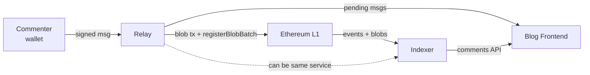
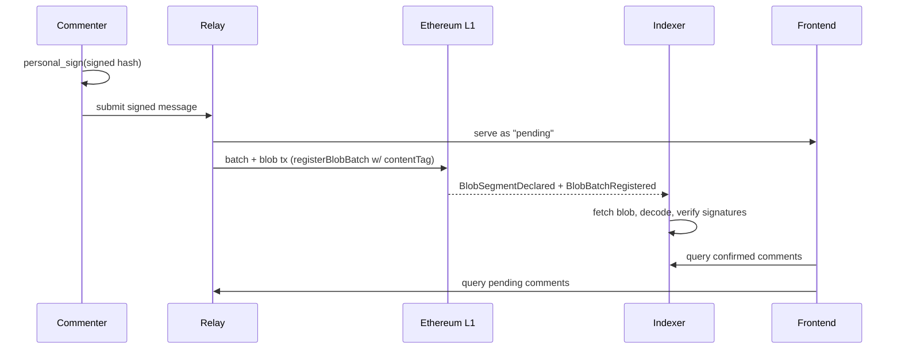
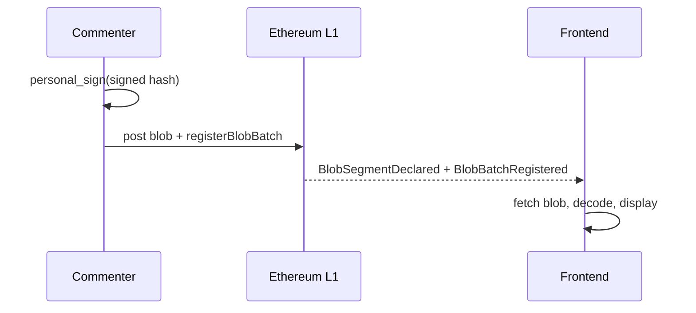

# On-chain blog comment section

An on-chain comment system for a blog, built on BAM (Blob Authenticated Messaging, ERC-8179/8180). This doc sketches the architecture — how comments get authored, batched, posted, indexed, and displayed. Content moderation and cost analysis are deferred.

## Status

This is a design sketch, not a spec. Several primitives the design assumes are not yet present in this repo — see **Prerequisites** below. Where the doc describes concrete behavior ("the relay does X"), it's describing what the system would do assuming those prerequisites land. Where a decision is deliberately left open, it's called out as an open question.

## Architecture

Commenters sign with `personal_sign` (ECDSA) over an ERC-8180 domain-separated hash, so they can use an existing wallet and signatures aren't replayable across chains. BLS aggregation could be added later if volume justifies the UX cost.

Terminology used below:
- **`contentTag`** — the `bytes32` identifier passed to `registerBlobBatch` and emitted as an indexed field in `BlobSegmentDeclared`. In this system, `contentTag = keccak256(canonicalBlogPostId)` identifies a blog post. The canonicalization rule for `canonicalBlogPostId` is an open question; every relay and indexer must agree on it. A bare post ID without an origin in the preimage risks different blogs colliding on the same tag and mixing their threads; a full URL (including origin) avoids this but requires a stable canonicalization rule.
- **message hash** — a hash over sender, nonce, and contents per ERC-8180, binding the message to its author and preventing replay.
- **signed hash** — the domain-separated hash passed to `personal_sign`; the domain includes the chain ID to prevent cross-chain replay.

### System overview

### Posting flow (happy path)

### Fallback flow (no server)

### Actors

- **Commenter** signs messages with `personal_sign` (ECDSA). Includes the blog-post topic in the signed payload so a relay can't reattribute the comment to another post (depends on Prerequisites #1).
- **Relay** accepts signed messages, batches them into blobs, and submits to L1 via the core contract's `registerBlobBatch`. Untrusted: it can censor or delay, but can't forge — messages are pre-signed. Anyone can run one.
- **Indexer** watches `BlobSegmentDeclared` events (filtered by `contentTag`) and joins with `BlobBatchRegistered` to discover the batch's `decoder` and `signatureRegistry`. Fetches blobs, decodes via the decoder, verifies signatures, and serves comment history via API. Untrusted: can omit but not forge. Often the same service as the relay.
- **Blog frontend** displays comments. Queries the indexer for confirmed comments and the relay for pending ones. Can fall back to scanning events directly if no indexer is available.

### Operating modes

The server (relay + indexer as one service) is the primary path. A self-index fallback exists so the system doesn't hard-depend on third-party infrastructure.

**With a server:**
1. Commenter signs the message (including topic — depends on Prerequisites #1) and submits to a relay.
2. Relay serves it as "pending" while queuing for the next blob.
3. Relay submits a single EIP-4844 transaction that posts the blob(s) and calls the core's `registerBlobBatch`, tagged with the topic's `contentTag`. See ERC-8180 / `IERC_BAM_Core` for the exact interface. The blob(s) and the register call must be in the same transaction — the core reads blob hashes via `BLOBHASH`, which only returns hashes for blobs attached to the current tx (per ERC-8179).
4. Indexer sees `BlobSegmentDeclared` (for `contentTag`) and `BlobBatchRegistered` (for decoder/signature-registry), fetches the blob, decodes, verifies, and exposes confirmed comments.
5. Frontend merges the confirmed (indexer) and pending (relay) views.

**Without a server (escape hatch, expensive — roughly $1–5 per comment at current blob gas):**
1. Commenter submits a single EIP-4844 tx with a one-comment blob and a `registerBlobBatch` call tagging the topic.
2. Frontend scans events by `contentTag`, joins with `BlobBatchRegistered` for decoder lookup, and reads the blob from the Beacon API or an archiver.

### Relay design

The relay's trust surface is liveness only. Multiple relays can operate concurrently for the same blog; if one censors or drops, commenters resubmit elsewhere. Signed messages are client-verifiable, so pending comments are already authenticated — they just aren't committed to chain yet. Relays may optionally gossip pending messages to each other so any relay can batch them.

### Topic routing

Topics are identified by `contentTag` (see Terminology). The tag appears in two places:

- **In the signed message** — binding the comment to a specific post so it can't be reattributed (depends on Prerequisites #1).
- **On-chain** — as the indexed `contentTag` field in `BlobSegmentDeclared`, so indexers can filter via indexed logs.

Topic spam is currently unprotected: anyone can tag junk blobs for any topic. Whether to filter at the contract level or the application level is an open question.

### Blob archival

Blobs are pruned from the Beacon chain after ~18 days. Archival options:

- Relays archive blobs as a side effect of posting them.
- Frontends pin blobs to IPFS as they read (readers become archivers).
- Third-party archivers (Blobscan, EthStorage).

With multiple relays, there are multiple archives by default.

### Ordering and deduplication

**Deduplication.** The dedup key is `(contentTag, messageHash)`. Once implementations agree on a canonical messageHash definition (Prerequisites #5), this key is stable across indexers and pending/confirmed state, so independent indexers converge on the same comment set. Once Prerequisites #1 lands and the topic is part of the signature, the external `contentTag` scoping becomes redundant.

**Ordering.** Confirmed comments are ordered by on-chain event position: `(block number, log index)` of the `BlobBatchRegistered` event, plus intra-batch position from the decoder. Two indexers with the same chain view and decoder agree on this order. Pending comments are ordered by relay arrival — advisory only; when a pending message confirms it takes its place in the chain-derived order.

The author-signed `timestamp` field is **not** used as an ordering source — it's author-controlled metadata, not an authoritative sequence.

**Nonces.** Nonces are part of the signed payload so a signature can't be reused under a different nonce. Strict nonce ordering is not enforced: comments arrive asynchronously, and dropping an out-of-order nonce would cause indexer divergence. Dedup by message hash already handles replay.

### On-chain exposure

Not needed in the happy path — comments are read by decoding blobs off-chain. On-chain exposure (e.g., an ERC-8180 exposer) would only become necessary if a downstream moderation contract needs to prove a specific message exists in a batch on-chain. That's a downstream decision, tied to Content moderation.

### Pending message edge cases

- Message stays pending too long: frontend flags it; commenter can resubmit to another relay.
- Relay goes down before batching: the commenter still has their signed message and can resubmit elsewhere.
- Duplicate submission across relays: dedup by message hash (see Ordering and deduplication).

## Content moderation

TBD. Requirements: decentralized (the blog author doesn't want to moderate), quality discussion, defense-favored asymmetry. Kleros is one candidate. This design will also determine whether on-chain exposure is needed.

## Prerequisites

The design above relies on a few things that don't exist in this repo as of writing. Each is called out so the doc's concrete claims stay tethered to what needs to change for them to hold.

1. **Topic binding in the signature.** The author's signature must commit to a specific topic so a relay can't reattribute a comment to a different post. Without it, topic binding is only an indexer-side convention, and dedup must scope externally by `(contentTag, messageHash)` as an interim measure.

2. **Canonical `messageId` definition.** ERC-8180 defines `messageId = keccak256(author, nonce, contentHash)` where `contentHash` is a batch identifier. The SDK needs a helper that matches this spec form, distinct from the per-message hash used today.

3. **Keyless ECDSA signature registry.** ERC-8180 permits ECDSA registries that verify via `ecrecover` without per-address registration. A minimal such registry is needed so `registerBlobBatch` calls name a real registry and batches remain interoperable with generic ERC-8180 tooling.

4. **Confirmed-order source that isn't author-controlled.** Confirmed comments are ordered by event-log position (`block number, log index, intra-batch index`), not by the author-signed `timestamp`. This is achievable today; it's listed here to make the non-use of `timestamp` for ordering explicit.

5. **Domain-separated ECDSA signing.** Signatures should be domain-separated by chain ID to prevent cross-chain replay. The SDK needs a consistent signing helper so all callers use the same domain, and the message-hash input needs to be pinned (spec-aligned vs. SDK wire format) so third-party tooling can verify signatures without bespoke knowledge.

## Existing BAM infrastructure used

| Component | Role |
|---|---|
| `BlobAuthenticatedMessagingCore` (ERC-8179/8180) | Blob registration with indexed `contentTag` for topic routing |
| `bam-sdk` | Message encoding, signing, blob construction |

## Assumptions

- Blob gas stays cheap enough that batching comments into blobs is economically viable.
- The Beacon API (or an archiver) is reliable enough to support the self-indexing fallback.
- A 280-character default content limit is a reasonable first cut (configurable; wire format allows up to 65535 bytes).
- The 18-day blob pruning window is long enough for at least one archiver to retain each blob.
- Moderation can be layered on after the base protocol ships without changing the registration flow.

## Open questions

In this document's scope:
- Topic ID format and canonicalization: whether the `contentTag` preimage is a stable per-post ID, a full URL (including origin), or something else — and what the exact normalization rule is. Relays and indexers must agree on it; a preimage without an origin risks cross-blog tag collisions.
- Relay incentives: commenter-paid fee, altruistic, self-hosted by the blog author?
- Archival guarantees: relay-side archival plus opportunistic IPFS pinning, or an explicit DA commitment?
- Moderation contract design (see Content moderation).
- Identity and reputation: ENS integration? Anything beyond raw addresses?
- Threading: how the message format should represent replies and parent references.
- Cost analysis: per-comment cost at different volumes, with a worked example at a specific blob-gas / ETH-price / comments-per-blob snapshot.

Upstream (would improve this system and any other built on BAM):
- Topic binding in the signature — Prerequisites #1.
- `computeMessageId` alignment with ERC-8180 — Prerequisites #2.
- A keyless ECDSA signature registry in `bam-contracts`, or a codified convention for how clients should handle `signatureRegistry = address(0)` for ECDSA batches — Prerequisites #3.
- Domain-separated ECDSA signing and message-hash definition alignment (spec-aligned vs. SDK-wire-format) in the SDK — Prerequisites #5.
- Topic spam protection at the contract level vs. application level.
