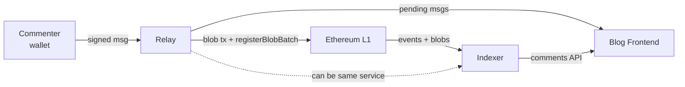
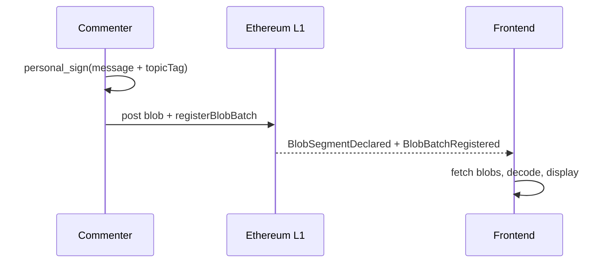

# On-chain blog comment section

An on-chain comment system for a blog, with everything on L1 and decentralized moderation.

This doc covers the reading and writing infrastructure: how comments get authored, batched, posted, indexed, and displayed. Content moderation is a separate problem (TBD below).

## Architecture

Built on BAM (Blob Authenticated Messaging), using the `BlobAuthenticatedMessagingCore` contract (ERC-8179/8180). Comments are signed with `personal_sign` (ECDSA) using the ERC-8180 signing domain (`keccak256(abi.encodePacked("ERC-BAM.v1", chainId))`) so users can just use their existing wallet. BLS aggregation could be added later if volume justifies the UX cost.

### System overview

### Posting flow (happy path)

### Fallback flow (no server)

### Actors

- **Commenter** signs messages (including the topic tag) with their wallet via `personal_sign` (ECDSA) using the ERC-8180 signing domain. No key registration needed. The topic is bound to the signature, so a relay cannot repost a comment under a different blog post.
- **Relay** accepts signed messages, batches them into blobs, posts to L1 via `registerBlobBatch()` with a `contentTag` matching the topic. Relays MUST use a non-zero `decoder` (see "Batch metadata" below; `signatureRegistry` MAY be zero for ECDSA). Untrusted: it can censor or delay, but can't forge anything because messages are pre-signed and topic-bound. Anyone can run one.
- **Indexer** watches `BlobSegmentDeclared` events (filtered by `contentTag`) and joins with `BlobBatchRegistered` events (by `versionedHash`) to discover the batch's `decoder` and `signatureRegistry` (see "Batch metadata" for required non-zero values). Fetches blobs, decodes, verifies signatures, and serves comment history via API. Can be the same service as the relay. Also untrusted: it can omit comments but can't forge them.
- **Blog frontend** displays comments. Two modes: query the server (fast) or self-index from chain (slow, expensive, but works without any infrastructure).

### Operating modes

The server is the fast path. The frontend fallback exists so the system doesn't hard-depend on anyone's infrastructure.

**With server (fast path):**
1. Commenter signs a message with `personal_sign`, including the blog post topic tag in the signed payload
2. Submits to a relay
3. Relay serves the message immediately as "pending" via API
4. Relay submits a single EIP-4844 transaction that carries the blob(s) and also calls
   `registerBlobBatch(blobIndex, startFE, endFE, contentTag, decoder, signatureRegistry)` where
   `contentTag = keccak256(topicId)`, `decoder` is the BAM message decoder deployed for this
   protocol, `signatureRegistry` can be `address(0)` for ECDSA (indexers verify via `ecrecover`;
   see "Batch metadata"), and `(blobIndex, startFE, endFE)` addresses the segment inside the
   attached blob (for a relay that fills a whole blob per batch, `(0, 0, 4096)`; for partial
   blobs the relay tracks its own segment cursor). The blob and the `registerBlobBatch` call MUST
   be in the same transaction — `registerBlobBatch` reads the blob's versioned hash via
   `BLOBHASH(blobIndex)`, which only returns hashes for blobs attached to the current tx, and
   `blobIndex` MUST match the blob's 0-based position in that tx (per ERC-8179).
5. Indexer (can be the same service) watches `BlobSegmentDeclared` events filtered by `contentTag`, joins with `BlobBatchRegistered` for decoder/registry lookup, fetches/decodes blobs, serves comment history
6. Frontend queries the indexer for confirmed comments and the relay for pending ones

**Without server (escape hatch, not a primary UX):**
1. Commenter signs a message with their wallet, including the topic tag
2. Commenter submits one EIP-4844 transaction carrying the blob and calling
   `registerBlobBatch(0, 0, 4096, contentTag, decoder, signatureRegistry)` — one comment per blob
   (full-blob segment), using the same `decoder` the indexers expect for this protocol
   (`signatureRegistry` can be `address(0)`; see "Batch metadata"). The blob and the register call
   MUST be in this single transaction (see happy path step 4 for why). Roughly $1-5 at current
   blob gas prices.
3. Frontend scans `BlobSegmentDeclared` events by `contentTag`, joins with `BlobBatchRegistered` for decoder lookup, and fetches blobs from the Beacon API or archivers
4. Works, but too expensive for regular use

### On-chain exposure

Not needed in the happy path. Comments are read by decoding blobs off-chain.

Whether on-chain exposure is needed depends on the moderation design (TBD). KZG exposure requires per-message field element alignment in the blob, which constrains compression and reduces how many comments fit per blob. If moderation can work without exposure, blobs can be compressed more aggressively.

### Relay design

The relay's trust model is liveness only. It can't forge signatures, only censor or delay.

Multiple relays can operate for the same blog. If one censors or goes down, commenters resubmit to another. Relays serve queued messages via API before they're batched into a blob. Signatures are verifiable client-side, so pending comments are already authenticated, just not yet committed to chain.

Optionally, relays can gossip pending messages to each other so any relay can batch them.

### Batch metadata

`decoder` MUST be non-zero — it's the deployed BAM message decoder for this protocol (same address
across all comment batches so indexers can cache its interface). ERC-8180 §10 permits `decoder=0`
but labels it "NOT RECOMMENDED" because it breaks the "anyone can read" property; for comments
there's no use case for that mode. Indexers MUST ignore batches whose `BlobBatchRegistered` event
shows `decoder=0`.

`signatureRegistry` MAY be `address(0)`. ERC-8180 treats `signatureRegistry=0` as "verified off
chain", and for the ECDSA signatures this system uses (via `personal_sign`) indexers verify
authorship by `ecrecover` alone — no registry needed in the happy-path read flow. The spec explicitly
sanctions this at §9.2: "ECDSA-based registries MAY allow keyless verification via ecrecover-style
key derivation." A non-zero `signatureRegistry` becomes load-bearing only when on-chain message
exposure is added (e.g., for a moderation contract that verifies a specific message on-chain —
on-chain code can't reach the off-chain ecrecover results, so it needs a registry or dispatcher).
Until then, relays MAY pass `address(0)` for `signatureRegistry`; indexers MUST NOT treat
`signatureRegistry=0` as a reason to drop comments, and MUST verify authorship via `ecrecover`
using the `author` field in the decoded message.

### Topic routing

Topics are identified by a `bytes32 contentTag` (e.g., `keccak256(blogPostUrl)`). This tag appears in two places:

1. **In the signed message**: the topic is included in the commenter's signed payload, binding the comment to a specific blog post. A relay cannot reattribute a comment to a different topic without invalidating the signature.
2. **On-chain**: relays pass the same `contentTag` to `registerBlobBatch()`, which emits it as an indexed field in `BlobSegmentDeclared`. Indexers filter events by `contentTag` to find relevant blobs efficiently via indexed logs.

### Blob archival

Blobs get pruned from the Beacon chain after ~18 days. A few ways to keep them around:

- Relays archive blobs as a side effect of posting them
- The blog frontend pins blobs to IPFS as it reads them (readers become archivers)
- Third-party blob archivers (Blobscan, EthStorage)

Multiple relays means multiple archives.

### Nonce handling and deduplication

Nonces are included in the signed payload (per ERC-8180 signing rules) so that a signature binds to
a specific `(author, nonce, content, ...)` tuple — an attacker can't take a signed message and
re-use the signature under a different nonce.

Beyond that, indexers and frontends in this system MUST:

- De-duplicate by a topic-scoped message key: `keccak256(topicTag, computeMessageHash(msg))` (or
  equivalently `(topicTag, computeMessageHash(msg))` as a tuple). The scoping by `topicTag` is
  necessary because `bam-sdk`'s `computeMessageHash` does not yet include the topic field (see
  upstream open question), so identical `(author, nonce, content)` posted under different blog
  posts would otherwise collide. Once the SDK includes `topicTag` in the signed payload, the
  explicit scoping becomes redundant and the dedup key collapses to `computeMessageHash(msg)`.
  This key is stable across pending (relay-served) and confirmed (on-chain) views, so the same
  comment doesn't appear twice when a pending message later lands in a blob.
- Accept any message with a valid signature and ignore the order in which nonces arrive. Display
  ordering uses `(timestamp, nonce)` as the tiebreaker within an author's comments.

Note: ERC-8180 §"Nonce Semantics" says clients SHOULD treat messages whose nonce does not exceed
the sender's last-accepted nonce as invalid. This system deliberately diverges from that SHOULD,
because comments arrive asynchronously through multiple relays and chain propagation — indexer A
seeing `nonce=3` before `nonce=2` while indexer B sees them in order would produce divergent
comment sets and break the convergence property we care about. Per-message-hash dedup already
handles exact replay, and signing the nonce into the hash prevents signature reuse across
different nonces, so the strict rejection rule buys us nothing here.

ERC-8180 also defines `messageId = keccak256(author, nonce, contentHash)` where `contentHash` is
the *batch* identifier (blob versioned hash). That form only exists after confirmation and is not
suitable for pending-vs-confirmed dedup, which is why this system uses the message-level hash. See
"Open questions" for the SDK naming discrepancy.

The combination (signed nonce + per-message-hash dedup + order-independent acceptance) makes
independent indexers converge on the same comment set and prevents relay replay attacks.

### Pending message edge cases

- Message stays pending too long: frontend flags it, commenter can resubmit to another relay
- Relay goes down before batching: commenter still has their signed message, resubmits elsewhere
- Duplicate submission across relays: dedup by the per-message hash (see above)

## Content moderation

TBD. The requirements: decentralized (blog author doesn't want to moderate), high quality discussion, offense/defense asymmetry favoring defense. Kleros is a candidate. This design will also determine whether on-chain exposure is needed (see above).

## Existing BAM infrastructure

| Component | Role |
|---|---|
| `BlobAuthenticatedMessagingCore` | Blob registration with indexed `contentTag` for topic routing (ERC-8179/8180) |
| `bam-sdk` | Message encoding, signing, blob construction |

## Assumptions

Infrastructure:
- Blob gas stays cheap enough for comment batching to be viable
- Beacon API is accessible and reliable enough for the frontend fallback
- 280-character default message limit works for blog comments (configurable, wire format supports up to 65535 bytes)

Trust model:
- Signing the nonce into the message hash prevents signature reuse across different nonces; per-message-hash dedup prevents exact replay
- Dedup by the per-message hash is sufficient, and independent indexers will converge on the same state regardless of the order in which messages arrive
- Topic tag is included in the signed payload, so relays cannot misattribute comments across topics
- `contentTag` in `registerBlobBatch()` needs no access control (anyone can tag any topic, but the signed topic in the message is authoritative)

Lifecycle:
- 18-day blob pruning window is long enough for at least one archiver to grab the data
- Fallback mode (one comment per blob) is usable as an escape hatch, if expensive

Moderation:
- Content moderation can be layered on after the base protocol ships, without needing to change the registration flow

## Open questions

Upstream (impacts BAM SDK):
- The 280-character message limit (`MAX_CONTENT_CHARS`) is now configurable via `encodeMessage()` options. The SDK already supports >255-byte content by auto-setting `FLAG_COMPRESSED` and switching to a uint16 length encoding. Note: `FLAG_COMPRESSED` is overloaded — it currently signals "extended content length" rather than actual compression. This naming should be cleaned up.
- The message hash (`computeMessageHash`) does not currently include a topic field. A new field (e.g., `bytes32 topicTag`) needs to be added to the signed payload so that comments are cryptographically bound to a specific blog post.
- Topic routing has no spam protection. Anyone can tag junk blobs for any topic via `registerBlobBatch()`. Should filtering happen at the contract level or application level?
- `bam-sdk`'s `computeMessageId()` currently returns the hex of `computeMessageHash()` (per-message: author, nonce, content, ...), which does **not** match ERC-8180's `messageId = keccak256(author, nonce, contentHash)` where `contentHash` is the batch identifier (versioned hash). The helper name is misleading. Options: rename the SDK helper to `computeMessageHashHex` (or just remove it and have callers use `computeMessageHash` directly), and/or add a separate `computeMessageId(msg, batchContentHash)` that implements the ERC-8180 form. This comment system dedups by the per-message hash (see Nonce section), so the discrepancy isn't blocking, but the SDK API should be disambiguated before other consumers adopt it.

This spec:
- Topic ID format: blog post URL hash vs. sequential ID vs. something else
- Relay incentives: do commenters pay a small fee, or is relay operation altruistic/self-hosted?
- Archival guarantees: is relay-side archival enough, or do we need an explicit DA commitment?
- Moderation contract design (see above)
- Identity/reputation: ENS integration? Any signal beyond raw addresses?
- Threading: how does the message format handle replies and parent references?
- Cost analysis: per-comment cost at different volumes, sensitivity to blob gas prices. Needs a worked example at a specific snapshot (blob gas price, comments per blob, ETH price)
