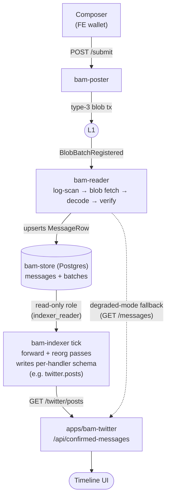

# Indexer design notes

## Layering

Three roles, three concerns:

| Layer | What it does | Boundary | This repo |
|---|---|---|---|
| **Protocol indexer** | L1 event scan → blob fetch → decode → signature verify → confirmed messages per `contentTag` | ERC-8180 — protocol-level | `bam-reader` |
| **App indexer** | Typed entities per `contentTag` + on-chain enrichment + multi-consumer query API | Per-app, app-agnostic in shape (multi-consumer) | `bam-indexer` (this layer) |
| **BFF / FE** | App-shaped response shaping, ranking, personalization, auth, pagination policy | Per-FE — knows the consumer | apps/* (Next.js routes today) |

The boundary that earned this whole package: an **indexer** is
*multi-consumer* and *app-agnostic in its data model*. A **BFF**
knows its single FE and bakes that knowledge into response shape.
Both can run in the same process, but conflating them in
architecture is sloppy. The Twitter discussion that produced this
design started from the quote *"an indexer which … applies relevant
application logic"* — that phrasing is BFF-shaped, not
indexer-shaped, and we kept the layer indexer-shaped by stripping
out the application-logic line.

## End-to-end lifecycle (Twitter as the worked example)



The dotted edge is the constitution's "degraded mode"
(`.specify/memory/constitution.md:105`): the Reader is the only
required dependency; the indexer is a richer cache on top.

## Why a second indexer above the Reader

`bam-reader`'s output is `MessageRow` per `contentTag`:
`(sender, nonce, contents, messageHash, batchRef, blockNumber, …)`.
It does NOT:

- Decode the app-specific payload inside `contents` (each app has
  its own codec — Twitter's `version ‖ kind ‖ payload`, Comments'
  `(siteId, postId)` envelope, blobble's plain timestamped text).
- Join `sender` against on-chain registries (ENS, ECDSARegistry,
  StakeManager).
- Materialize derived views (thread trees, profile timelines).
- Surface anything richer than a paginated `GET /messages`.

Some layer has to do those things. Putting them in the FE means
every app re-implements the same thread tree, the same ENS lookup,
the same stake join — and forces decode into the browser bundle.
The indexer is the single place that work lives, with handlers as
the per-app extension points.

## Package shape

```
packages/bam-indexer/
├── src/
│   ├── factory.ts        # createIndexer(config, extras) — DI-friendly entry
│   ├── index.ts          # public barrel
│   ├── types.ts          # IndexerConfig, IndexerEvent, counters
│   ├── errors.ts         # IndexerError taxonomy → CLI exit codes
│   ├── framework/
│   │   ├── handler.ts    # IndexerHandler<E> interface — the extension point
│   │   ├── registry.ts   # uniqueness checks (tag / name / schema)
│   │   ├── cursor.ts     # indexer.cursor CRUD + chain-coord WHERE helpers
│   │   ├── migrate.ts    # version-bump truncate, idempotent DDL runner
│   │   └── tick.ts       # forward pass + reorg pass per handler
│   ├── source/
│   │   └── bam-store-source.ts  # raw SELECTs over bam-store (no drizzle dep)
│   ├── enrichers/
│   │   ├── types.ts      # EnricherPool surface
│   │   ├── batch.ts      # fan-out by EnrichmentRequest.kind
│   │   └── ens.ts        # reverse(sender), TTL cache + negative cache
│   ├── http/
│   │   ├── server.ts     # framework + handler routes; :param matching
│   │   └── routes.ts     # GET /health
│   ├── handlers/
│   │   └── twitter/
│   │       ├── handler.ts # IndexerHandler<TwitterMessage>
│   │       ├── schema.ts  # twitter.posts DDL
│   │       └── routes.ts  # GET /twitter/posts, /:messageId, /replies, /profile/:sender
│   └── bin/
│       ├── bam-indexer.ts # serve | reset --handler X --yes
│       └── env.ts         # INDEXER_* parsing
└── tests/unit/            # registry, tick, twitter handler
```

## Handler interface

Per-`contentTag` plugin. Everything app-specific is contained here:

```ts
// packages/bam-indexer/src/framework/handler.ts
export interface IndexerHandler<E> {
  contentTag: Bytes32;          // routing key
  name: string;                  // URL prefix, schema name, cursor key
  version: number;               // bump → truncate + re-project this handler only
  schema: string;                // Postgres schema this handler owns

  migrate(client: PoolClient): Promise<void>;          // idempotent DDL
  decode(contents: Uint8Array): E | null;              // null = drop poisoned row
  enrichments?: EnrichmentRequest[];                   // declared, framework resolves
  project(msg, decoded, enriched, txn): Promise<void>; // idempotent upsert
  onReorg(txHash, chainId, txn): Promise<void>;        // evict cascade
  routes: BoundHandlerRoute[];                         // GET routes the HTTP server mounts
}
```

Adding a new handler is in-tree today — drop a folder under
`src/handlers/`, register it in the `HANDLERS` array in
`src/bin/bam-indexer.ts`. No plugin loader; revisit when there's a
real third-party asking.

## Tick loop

A single ordered pass per handler per tick, two phases:

1. **Forward.** Read `MessageRow`s where
   `(blockNumber, txIndex, msgIndex)` is strictly greater than the
   handler's cursor, limited to `INDEXER_BATCH_SIZE`. For each row:
   `handler.decode` (null → bump `skippedDecode`, advance cursor
   past the row) → resolve enrichments → `handler.project` and
   `upsertCursor` in **one** write txn.
2. **Reorg.** Read `batches` rows where `status='reorged' AND
   invalidated_at > cursor.last_reorg_invalidated_at`. For each:
   `handler.onReorg(txHash, chainId, txn)` + cursor bump in one
   write txn.

Single in-flight tick at a time — if a tick runs long, the next
interval is skipped rather than overlapped (factory's `serve` loop
in `src/factory.ts`).

## Cursor coordinate

`indexer.cursor` row per handler:

```sql
CREATE TABLE indexer.cursor (
  handler_name              text PRIMARY KEY,
  handler_version           integer NOT NULL,
  last_block_number         bigint  NOT NULL,
  last_tx_index             bigint  NOT NULL,
  last_msg_index            bigint  NOT NULL,    -- finer than Reader's (block, tx)
  last_reorg_invalidated_at bigint  NOT NULL,
  updated_at                bigint  NOT NULL
);
```

**Forward cursor** keys at `messageIndexWithinBatch` granularity —
finer than `bam-reader`'s `(blockNumber, txIndex)` — so a packed
transaction with N messages can resume mid-batch on crash.

**Reorg cursor** keys off `batches.invalidated_at`, the only
monotone "something was reorged" signal in `bam-store` today
(messages have no `updated_at` column). `markReorged` updates batch
+ messages atomically, so cursoring on the batch-level timestamp
never misses a cascade.

**Crash safety.** Per-row project + cursor bump happen in the same
write txn. A crash mid-tick re-projects the in-flight row on next
start — `handler.project` MUST be idempotent. The Twitter handler
uses `INSERT … ON CONFLICT (message_id) DO UPDATE` so this holds.

## Schema versioning

No migration library. Each handler declares a `version` integer.
On startup `migrate.ts` compares `handler.version` to the row in
`indexer.cursor`. Mismatch:

1. `DROP SCHEMA <handler.schema> CASCADE`.
2. Delete the cursor row for that handler.
3. `handler.migrate()` recreates the schema and tables.
4. The next tick re-projects from genesis.

Trade-off: a busy deployment loses its projection on a version bump
and rebuilds from genesis. The alternative (parallel versions, dual
writes) is over-engineering for v1 with one handler. Source-DB rows
are never touched — only the handler's own tables.

This mirrors `bam-store`'s posture in
`packages/bam-store/src/schema/index.ts` — bumping `SCHEMA_VERSION`
there refuses to boot against an older DB; here it forces a rebuild
of one handler's projection.

## Reorg semantics

Reader's `markReorged` in `packages/bam-store/src/postgres.ts:495`
atomically flips `batches.status='reorged' + invalidated_at` and
cascades `messages.status='reorged'` for every row under that
`batch_ref`. The indexer cursors on `batches.invalidated_at` — a
per-handler "highest seen" — so a reorg surfacing in the source DB
is visible on the next tick without any L1 RPC.

Per-handler reorg = `handler.onReorg(reorgedTxHash, chainId, txn)`.
The Twitter handler `DELETE`s its rows by `batch_ref`, which keys
off the same column Reader cascades. The framework calls it inside
a write txn so the eviction + cursor bump are atomic.

## Enricher pool

Cross-cutting on-chain reads live in `src/enrichers/`. v1 wires
ENS only; the other enrichment kinds are declared in the handler
interface so handlers can stake out their needs ahead of
`StakeManager` / `ECDSARegistry` integration without re-shaping the
call surface later.

```ts
enrichments: [
  { kind: 'ens',             from: 'sender' },     // wired, viem RPC
  { kind: 'stake',           from: 'sender' },     // declared, returns null today
  { kind: 'ecdsa-registry',  from: 'sender' },     // declared, returns null today
  { kind: 'allowlist',       from: 'submitter' },  // declared, returns null today
]
```

`BatchEnricherPool` fans out by `kind`. ENS resolves at
indexer-head (not at message block) with TTL cache: 1h on hits,
5min on misses, LRU at 10k entries. When stake is wired it MUST
resolve at the message's inclusion block to stay reproducible
across indexers — that's a documented requirement, not a current
behaviour.

## HTTP

Server: `127.0.0.1:8789` default. Two route sources:

- Framework — `GET /health` (cursor lag per handler, registered
  handler set, uptime).
- Each handler's `routes` array, mounted as the handler declares
  (handlers prefix their own paths with `/<handler.name>` to avoid
  collision).

Twitter routes (server-shaped, not FE-shaped):

| Path | Returns |
|---|---|
| `GET /twitter/posts?sender=&since=&limit=` | top-level posts, newest-first |
| `GET /twitter/posts/:messageId` | single post |
| `GET /twitter/replies?parentMessageHash=&limit=` | replies under a parent |
| `GET /twitter/profile/:sender?limit=` | denormalized ENS + post window |

Wire shape uses snake_case columns (`message_id`, `message_hash`,
`sender`, `block_number`, `sender_ens`, …). No feed assembly, no
ranking — those belong above the indexer line.

## Why hand-rolled REST over PostgREST or GraphQL (today)

PostgREST and Postgraphile/Hasura are reasonable answers when the
indexer has ≥2 handlers and a real federation requirement. v1 ships
one handler (Twitter) and four routes; the operational cost of a
sidecar isn't justified yet. Revisit when comments + blobble
handlers land in Phase 2.

Each route maps to one indexed query and is small enough that
hand-rolled is shorter than describing the same response via a
generator. If a handler grows past ~6 routes the cost-benefit flips
toward a generated layer.

## Postgres role split

Two roles:

- `indexer_reader` — `SELECT` on `public.messages`, `public.batches`.
- `indexer_writer` — full rights on `indexer.*` and per-handler
  schemas (`twitter.*`, …).

Defense in depth: a bug in `handler.project` can never corrupt
Reader-owned tables. In dev the same DSN works for both
(`INDEXER_WRITE_DB_URL` falls back into `INDEXER_DB_URL`).

The DDL to set this up is in `packages/bam-indexer/README.md`.

## Trust model (ERC-8179 / ERC-8180)

Indexers are not trusted. The standards explicitly support multiple
independent indexers per `contentTag`, and the framework here is
deterministic given:

- a fixed source DB state (Reader-written),
- a fixed handler set + version,
- and the same enrichment configuration.

Enricher outputs (ENS now; stake later) are advisory — consumers
should treat them as such. Two indexers with different RPCs may
diverge on `sender_ens`, never on whether a message was confirmed.

This is the property that decided the layer's shape. If "feed
ranking" or "Twitter-specific response wrapping" leaked into the
indexer, two indexers with different policies would diverge on
visible content — and that's exactly the divergence ERC-8179/8180
say must not happen at this layer. Hence: BFF for FE-shape; indexer
for entities.

## Operational reference

The operator-facing config (env vars, CLI, role-split DDL, /health
shape) lives in `packages/bam-indexer/README.md`. This file is the
*why*; the README is the *how*. A few load-bearing defaults:

- `INDEXER_POLL_MS = 5000` — most ticks are no-ops; Reader writes
  every ~12s. Matching the cadence reduces source-DB query load.
- `INDEXER_BATCH_SIZE = 200` — one tick can drain a small backlog;
  bigger backlogs drain across ticks (no overlap).
- `INDEXER_HTTP_BIND = 127.0.0.1` — matches `bam-reader`'s
  red-team C-1; operator fronts it with a reverse proxy if
  exposed.

## Open questions

- **Late ENS attribution.** A sender posts at block N with no ENS,
  then registers / sets a primary name at block N+k. The post was
  already projected, so `twitter.posts.sender_ens` is frozen at
  `null`. The enricher cache will pick up the new name eventually
  (5min miss TTL), but that only affects *future* projections —
  existing rows are never revisited. Two responsibilities are
  conflated today: "ENS at message inclusion block" (stake-style,
  reproducible) and "ENS as displayed in the UI" (live, follows
  the sender). The current code does neither cleanly — it captures
  ENS at indexer-head at first-projection time, which is a function
  of indexer lag rather than the sender's intent. Candidate
  resolutions: (a) drop `sender_ens` from `twitter.posts` and JOIN
  against a `senders` table keyed on address that a background
  job refreshes; (b) keep the column but add a periodic
  reproject-ens sweep; (c) make ENS strictly query-time and let the
  BFF resolve. Decision deferred until comments / blobble handlers
  land and we see whether the same shape applies to them.

## Out of scope (deferred)

- **Comments + blobble handlers** — Phase 2. The framework should
  not change to support them; that's the test that the boundary is
  real.
- **Stake / ECDSARegistry / allowlist enrichers** — Phase 3, needs
  `StakeManager` wired.
- **PostgREST / GraphQL gateway** — Phase 4, when ≥2 handlers exist.
- **Reader HTTP source mode** — today the indexer reads `bam-store`
  Postgres directly; the source interface allows swapping in an
  HTTP source for third-party operators who don't own the DB.
- **Out-of-tree handler plugins** — v1 keeps handlers in-tree; fork
  the package if you need a custom handler.
- **Auth** — read-only, public surface, fronted by a proxy if
  exposed.
