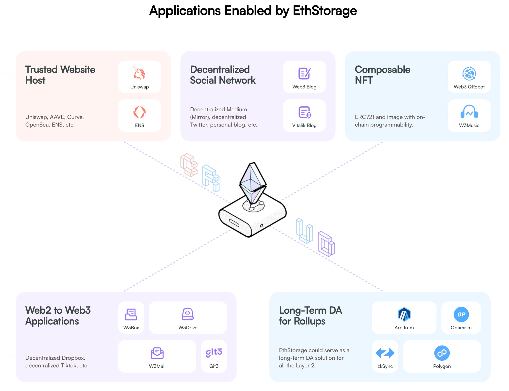

# Long-term blob storage

## Context

Currently Ethereum blob data (EIP-4844) is pruned after approximately 18 days by default. Accessing blob data after that point therefore depends on an out-of-protocol archival mechanism. Long-term availability of blobs is required for many blob use-cases.

The goal of this document is to summarise the currently avilable solutions for long-term blob storage.

This initial research aims to answer the following questions:
What happens to that data after the prune, who is storing it today and why?

## Comparison of existing solutions

| Service| Operator| How it works| Economic model|
| -------------- | ---------------------------- | ------------------------------------------------------------------------------------------------------------------------------------------------------------------------------------------------------------------------------------------------------------------------------------------------------------------------------------------------------------------------------------------------------------------- | ----------------------------------------------------------------------------------------------------------------------------------------------------------------------------------------------------------------------------------------------------------------------------------------------------------------------------------------------------------------------------------------------------------------------------- |
| **Blobscan**   | Blobscan   | Indexes all blobs from the network and stores them in multiple backends in parallel (Google Cloud Storage, PostgreSQL, Ethereum Swarm).   | As a blob explorer, archiving is part of its purpose as an exploration tool.   |
| **Etherscan**  | Etherscan  | Archives blobs as part of its general Ethereum indexation. The infrastructure is not publicly available, [multiple posts](https://x.com/etherscan/status/1876985385928032746) confirm [they store blobs](https://x.com/etherscan/status/1905230322008219863) but it is not revealed where or with what guarantees. | General Ethereum explorer. Blob archival is a natural extension of their product. |
| **EthStorage** | Network of storage providers | It is a storage layer 2. It works under a pay-to-store model: someone calls `putBlob()` on an L1 contract and pays in ETH. Its nodes also called providers download the blob, store it, and have to periodically prove they still hold it via zk-SNARK proofs. If the proof is valid, they collect from the original fee.  | Decentralised storage protocol. Providers earn ETH for keeping the data alive. Their documentation mentions the cost is around ~0.1% of L1 storage cost.|
| **Blockscout** | Blockscout | Block explorer software that indexes blobs directly into PostgreSQL (it has `beacon_blobs` and `beacon_blobs_transactions` tables). They currently also store blobs, but without formal guarantee of continuing to do so in the future. Sources: [1](https://www.blog.blockscout.com/blobs/), [2](https://docs.blockscout.com/api-reference/transactions/list-blobs-for-a-transaction)                              | Archiving blobs is part of its function as a blob explorer. |
| **Quicknode**  | Quicknode                    | [Blob sidecar API](https://www.quicknode.com/docs/ethereum/eth-v1-beacon-blob_sidecars-id). They said that "The complete history of blob data is supported." | RPC provider. Blob access is part of their Ethereum node infrastructure.   |
| **Base**       | Base `blob-archiver`         | A blob archiver that tracks the beacon chain and stores blobs. It supports both disk and S3-compatible storage. It exposes a Beacon sidecar API so clients can query archived blobs transparently. This is listed as a [requirement](https://github.com/base/node/blob/main/.env.mainnet) in Base's production node configuration. [Source](https://github.com/base-org/blob-archiver)   | It's an internal infrastructure for their OP Stack chain.   |
| **Optimism**   | Optimism `op-node`           | op-node has a [--l1.beacon-fallbacks](https://docs.optimism.io/node-operators/reference/op-node-config) flag that points to fallback endpoints implementing the Beacon API for fetching expired blobs. In practice, this connects to a blob archiver like the one Base built. [Source](https://arc.net/l/quote/yliihlbu) | Part of OP Stack node infrastructure. Operators are free to integrate [any archiver](https://arc.net/l/quote/uwxuosfx) backend that implements the Beacon API: a beacon node without pruning (Lighthouse), the Base blob-archiver, or an external service.  Other sources: [1](https://docs.optimism.io/chain-operators/guides/features/blobs) , [2](https://docs.optimism.io/op-mainnet/network-information/snapshots) |
| **Arbitrum**   | Arbitrum (delegates archival to third parties) | Does not have a dedicated blob archiver. Nodes depend on [beacon RPC providers](https://docs.arbitrum.io/run-arbitrum-node/l1-ethereum-beacon-chain-rpc-providers) with historical blob support. If a blob has expired, the node directs operators to a [list of third-party](https://docs.arbitrum.io/run-arbitrum-node/beacon-nodes-historical-blobs) providers. | No dedicated archival. Delegates to third-party beacon RPC providers. |
| **Scroll**     | Scroll                       | Operates a dedicated blob archive via [AWS S3 buckets](https://github.com/scroll-tech/go-ethereum/releases/tag/scroll-v5.10.0). Their node supports multiple blob data sources through dedicated flags: `--da.blob.awss3` (Scroll's S3, recommended), `--da.blob.beaconnode`, `--da.blob.blobscan`, and `--da.blob.blocknative`. Post-Fusaka, S3 is the [recommended primary source](https://docs.scroll.io/en/developers/guides/running-a-scroll-node/) since normal beacon nodes can no longer serve blob data under PeerDAS. | Internal infrastructure. Scroll operates the S3 archive for their chain. |

More details are presented below. If not needed, this section can be skipped directly to the conclusion.

## In depth

### Blobscan

[https://blobscan.com/](https://blobscan.com/)

Blobscan is an explorer designed specifically for blobs. It currently supports 6 storage backends that can run in parallel: Google Cloud Storage, AWS S3, Ethereum Swarm, Swarmy Cloud, PostgreSQL and filesystem.

The public instance at [blobscan.com](http://blobscan.com) uses GCS and Ethereum Swarm simultaneously, which gives it redundancy between a centralised and a decentralised backend.

The REST API allows querying blobs by versioned hash, KZG commitment, tx hash, slot or block number.

Sources: [docs.blobscan.com/docs/storages](https://docs.blobscan.com/docs/storages), [docs.blobscan.com/docs/features](https://docs.blobscan.com/docs/features), [GitHub](https://github.com/Blobscan/blobscan)

### OP Stack

[https://github.com/base-org/blob-archiver](https://github.com/base-org/blob-archiver)

Base built a [blob archiver](https://github.com/base-org/blob-archiver) that stores blobs before they are pruned from the beacon chain. It supports disk and S3-compatible storage and exposes the standard Beacon sidecar API (`/eth/v1/beacon/blob_sidecars`).

The OP Stack integrates blob archiving through `op-node's` [`--l1.beacon-fallbacks`](https://docs.optimism.io/node-operators/reference/op-node-config) flag. When the primary beacon node no longer has a blob, `op-node` queries these fallback endpoints instead. They are most likely using the blob-archiver created by Base.

In addition, in 2024 Optimism also funded EthStorage through a [grant](https://blog.ethstorage.io/ethstorage-receives-grant-from-optimism-for-offering-a-complete-long-term-da-solution-for-op-stack/) to integrate long-term blob storage into the OP Stack.

Sources: [blob-archiver repo](https://github.com/base-org/blob-archiver), [Base node config](https://github.com/base/node/blob/main/.env.mainnet), [op-node config reference](https://docs.optimism.io/node-operators/reference/op-node-config), [OP Stack blob management](https://docs.optimism.io/operators/node-operators/management/blobs), [EthStorage grant announcement](https://blog.ethstorage.io/ethstorage-receives-grant-from-optimism-for-offering-a-complete-long-term-da-solution-for-op-stack/)

### EthStorage

[https://ethstorage.io/](https://ethstorage.io/)

[https://www.youtube.com/watch?v=r9fXJ_QuR0Q](https://www.youtube.com/watch?v=r9fXJ_QuR0Q)

EthStorage is a storage Layer 2 for Ethereum and the only solution this research found with a decentralised incentive model for persisting blobs.

A user or application must pay for the data to persist over time. If required, they will call `putBlob` on the EthStorage contract deployed on L1, paying a fee in ETH that is around 0.1% of L1 storage cost according to their documentation.

The storage providers detect that transaction and download the blob from the Ethereum P2P network before it expires (before the 18 days). They have an anti-sybil mechanism, where each provider encodes the data with their own Ethereum address.

Periodically, the contract selects a provider at random and asks them to prove they hold the data. The provider generates a zk-SNARK proof (Proof of Random Access). If the proof is valid they collect a portion of the original fee.

The mainnet alpha has been live since October 14, 2025 on Ethereum mainnet, although storage providers still need to be whitelisted and the network is not permissionless yet.

The protocol has received grants from Optimism and other protocols. It has worked with Taiko, Celestia, etc.

Decentralised social networks are mentioned within their use cases, although there is none functionally built on the network yet.

Sources: [docs.ethstorage.io](https://docs.ethstorage.io/), [EthStorage Mainnet Alpha Launch](https://blog.ethstorage.io/ethstorage-mainnet-alpha-launch-petabyte-scale-decentralized-storage-on-ethereum/), [2025 Annual Report](https://blog.ethstorage.io/ethstorage-2025-annual-report/)

## Vitalik on distributed storage and blobs

There is a proposal ["Integrated in-protocol distributed history and state storage"](https://ethresear.ch/t/integrated-in-protocol-distributed-history-and-state-storage/23522) where he proposes packaging Ethereum's history inside blobs and having storage be distributed among the nodes of the network. The idea is that each node stores a fraction of the state instead of requiring everyone to store everything.

If this proposal moves forward, blobs would compete for space between L2 rollups, social applications and L1 data.

## Conclusion

Currently long-term blob storage relies mainly on block explorers (Blobscan, Etherscan, Blockscout) that archive blobs as an extension of their explorer services, and on rollup operators (such as Base and the broader OP Stack) that retain blob data because their own derivation pipeline depends on it. These solutions work but are centralised and depend on the operational continuity of each team or organization.

On the other hand, EthStorage introduces a new mechanism for blob data archival that provides decentralised economic incentives for the data to survive.

## Open Questions

- Could BAM leverage EthStorage as its archival layer?

## Additional Sources

- [Blobscan docs](https://docs.blobscan.com/)
- [Blobscan GitHub](https://github.com/Blobscan/blobscan)
- [Etherscan: Blobs Are Temporary and Permanent](https://medium.com/etherscan-blog/blobs-are-temporary-and-permanent-e07f3c4ca6e4)
- [EthStorage docs](https://docs.ethstorage.io/)
- [EthStorage Mainnet Alpha Launch](https://blog.ethstorage.io/ethstorage-mainnet-alpha-launch-petabyte-scale-decentralized-storage-on-ethereum/)
- [EthStorage 2025 Annual Report](https://blog.ethstorage.io/ethstorage-2025-annual-report/)
- [Blobs on Blockscout](https://www.blog.blockscout.com/blobs/)
- [Blockscout beacon/blob.ex](https://github.com/blockscout/blockscout/blob/master/apps/explorer/lib/explorer/chain/beacon/blob.ex)
- [Vitalik: Integrated in-protocol distributed history and state storage](https://ethresear.ch/t/integrated-in-protocol-distributed-history-and-state-storage/23522)
- [Vitalik: Ethereum has blobs. Where do we go from here?](https://vitalik.eth.limo/general/2024/03/28/blobs.html)