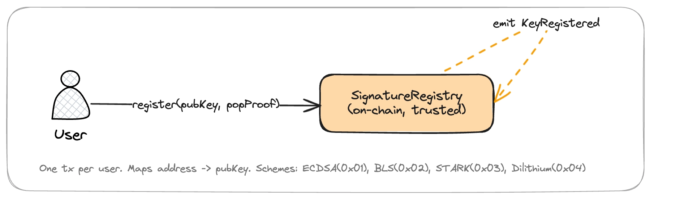
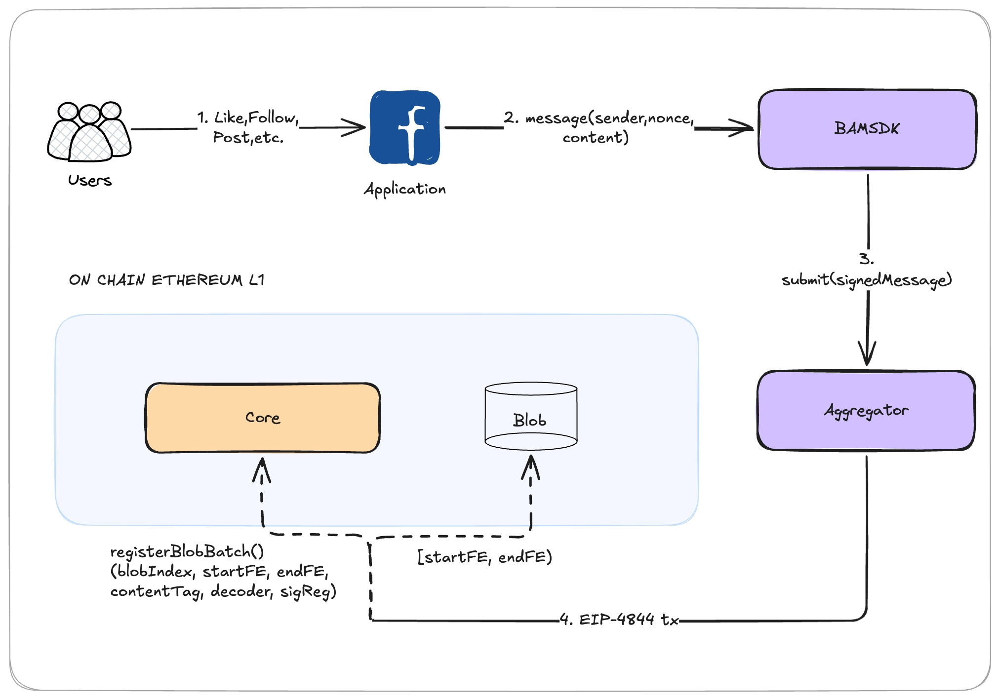
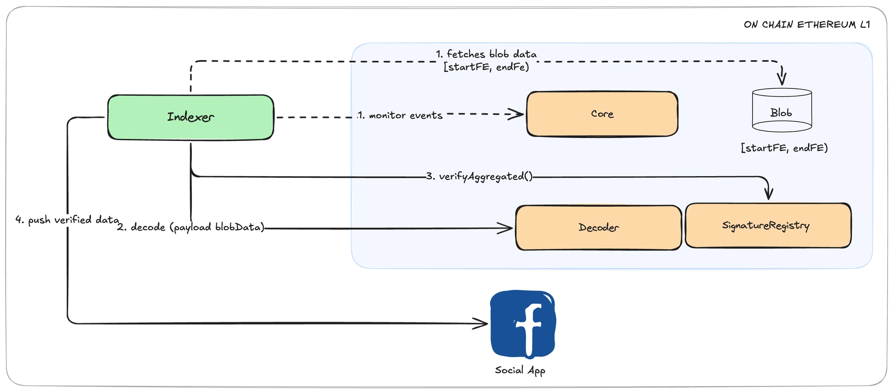
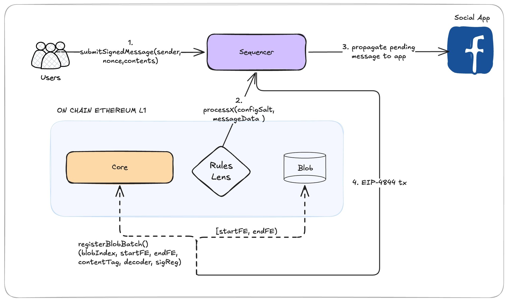
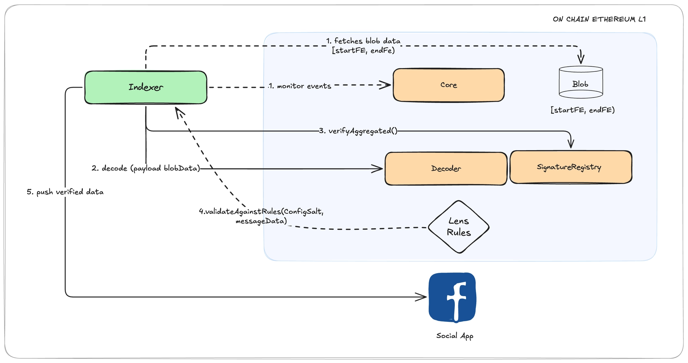
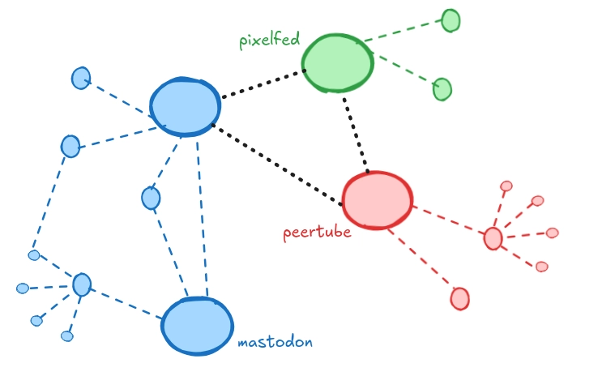

### Background

Each successful social network offered something new: Facebook the wall, Twitter the 140 characters, Snapchat the ephemeral messages. To be adopted, a social network needs to offer a form of interaction that did not exist before.

We are not building a social network: we are building BAM and BSS. A new kind of infrastructure using Blobs that can work B2B to offer social protocols tools they don't have today. For that we need to understand how they work, what needs they face, how they solve things currently, and what kind of tools we can offer them.

Part of that is understanding what can be implemented on-chain to generate efficiency and what should stay off-chain. This document explores how minimal rollups would look in our context of BAM and BSS.

## How everything works?

For better tracking of the diagrams, a color guide has been implemented: 🟪 off-chain components (SDK, Aggregator, Indexer, Archival Layer), 🟧 on-chain contracts (Core, Decoder, SignatureRegistry), 🟩 data/storage (Indexer, Archival Layer)

### Setup

This happens only once per user. The `SignatureRegistry` validates the proof of possession and maps the user's address to their public key. If already registered, it reverts with `AlreadyRegistered`. Supports multiple signature schemes (ECDSA, BLS, STARK, Dilithium)

### Publish

When the user creates a message inside the app. The app passes the message `(sender, nonce, contents)` to the BAM SDK. Internally the SDK: (1) computes the `messageHash`, (2) signs it with the user's BLS key, (3) encodes it to binary, (4) sends it to the Aggregator.

The Aggregator collects signed messages from multiple users, aggregates the BLS signatures into one,
can compress the batch (for example using zstd with a dictionary), and packs the payload into a blob segment `[startFE, endFE)`.

It then submits a single EIP-4844 transaction that carries the blob data and calls `Core.registerBlobBatch(blobIndex, startFE, endFE, contentTag, decoder, signatureRegistry)` 

- `Core.registerBlobBatch()` does two things in one call: (1) calls inherited `declareBlobSegment()` which emits `BlobSegmentDeclared`, and (2) emits `BlobBatchRegistered(versionedHash, submitter, decoder, signatureRegistry)`.

### Read and Verify

For the application to work correctly, there must be an indexer that is running continuously. 

1. It monitors `BlobBatchRegistered` events from `Core` (obtains the `versionedHash`, decoder address, and signature registry address) and retrieves the blob data in the range `[startFE, endFE)`
2. calls `Decoder.decode(payload)`, which returns `Message[] {sender, nonce, contents}` and the `signatureData`
3. calculates the `messageHash` and `signedHash` per message and then calls the `SignatureRegistry` contract with `verifyAggregated(pubKeys, signedHashes, signatureData)`  to valid messages update the state and invalid messages are discarded
4. Finally, sends the verified data to the application.  

### Other flows and components

1. **`Exposer`:**
    
    The `Exposer` is a contract that is not part of the normal publish/read flow. It exists for when someone needs to prove on-chain that a specific message has been published. Let’s suppose a smart contract that needs to verify that "Alice posted message X" to trigger a reward, dispute, or governance vote. 
    
    The `Exposer` contract could verify the message using, for example, a KZG proof (which proves that the bytes were in the blob) and checks the signature with the SignatureRegistry. If valid, it emits `MessageExposed`. The signature of the expose() function is not standardized because it varies depending on the type of proof (BLS+KZG, ECDSA+Merkle, STARK+ZK)
    
2. **`Archival Layer`**
    
    Blobs are pruned after ~18 days. The on-chain events (`BlobSegmentDeclared`, `BlobBatchRegistered`) persist forever, but the actual blob data disappears. If an application needs certain data to survive beyond pruning, an archival layer is required. For example, in a social application follows should never expire, losing your social graph would be fatal in this case an archival layer is required.
    
    Since the Indexer (described in [Read and Verify](https://www.notion.so/Read-and-Verify-31d9a4c092c780e1b1cad66534709448?pvs=21) ) already has the messages decoded and verified, the archival layer could plug into it and use that information to decide what to archive. 
    
    The application configures the retention policy: follows = permanent, likes = can expire, posts = depends. The archival layer reads from the Indexer, applies those rules, and stores accordingly. 
    

## Farcaster Insights:

Previously, Farcaster was explored in depth (including how its Hubs worked, its deltagraph system, and later its system called Snapchain), and five questions were raised. These questions were answered on Discord and are archived in this document.

<aside>
⚠️

The main questions were about message types enshrined for BAM. and if it’s possible use the ActivityPub vocabulary (W3C standard: defines Create, Like, Follow, Delete, Announce). 

The document also has an Improvement section, which is the most relevant (improvements to the blob system vs. the Farcaster system). [A6. Impovements](https://www.notion.so/A6-Impovements-31d9a4c092c780b0aae7f7896111d720?pvs=21) 

</aside>

## Firefly Insights:

Firefly is an aggregator app: you log in and get a unified feed from X, Mastodon, Lens, Farcaster, Mirror, Snapshot, etc. Vitalik has been using it for his posts on Lens and Farcaster. All of this reminds me a bit of WeChat: an app that connects multiple ecosystems (shopping, video, social media, news, its own internal TikTok).

So, if we imagine Firefly in the context of BAM, it would need to read messages from multiple BAM-based apps. Each app defines its own message format, so the aggregator would need to understand them all.
It occurred to me whether it would make sense to have a separate standard that standardizes message types between apps, something like the ActivityPub vocabulary. It sounds like a rather premature and unnecessary optimization at the moment, but I wanted to share it.

## [WIP] How everything will work with a sequencer:

# Apendix - Context about Fediverse and Activitypub:

*Above you can see some activities happening in a pub. Closest image I could find for the Fediverse.*

The *Fediverse* is a network of tens of thousands of independent platforms (mainly social) that interoperate via common protocols[.](https://en.wikipedia.org/wiki/Fediverse#:~:text=The%20Fediverse%20,5) Anyone can run a server (instance), host users, and decide who to interoperate with. Despite separate databases, moderation policies, and ranking algorithms, these instances exchange *activities* (posts, likes, follows, shares) across platform boundaries.

A user on *mastodon.org* (X) can reply to a user on [*linux.rocks](http://linux.rocks)* (X)*, or* follow a photographer on [*pixelfed.social*](http://pixelfed.social) (Instagram). This is done through ActivityPub, a W3C standard defining Actors, Objects, Activities and Delivery mechanisms.

Every instance remains fully autonomous: it can block other servers, apply custom moderation, rewrite ranking logic, or filter content entirely. Yet through ActivityPub, users experience a single social graph spanning Mastodon, Pleroma, Misskey, Pixelfed, Peertube, etc.

Historically, the Fediverse grows whenever centralised networks hit crises. When Twitter destabilised in late 2022, [Mastodon.org](http://mastodon.org/) MAU jumped past 2.5M. Even then, the ecosystem remains small; but *orders of magnitude* larger and more diverse than any Web3 social experiments (Lens, Farcaster). Some Web2 players like Tumblr and Meta’s Threads have begun implementing ActivityPub, which could bridge tens of millions of users into the Fediverse if done fully.

### What does ActivityPub mean for BAM?

ActivityPub as a federation protocol (servers talking to each other like Mastodon) does not apply. BAM does not federate, it publishes to Ethereum.

ActivityPub as a vocabulary of activity types (`Create`, `Like`, `Follow`, `Delete`, `Announce`) could serve as a reference. It is a W3C standard that already defines the semantics of social actions, and avoids reinventing types like Farcaster did. However, the ActivityPub format is JSON-LD, verbose and heavy. What BAM needs is a single byte per type (0x01, 0x02...) so the Indexer knows what to do with each message.

The practical approach: borrow the semantic concepts from ActivityPub (`Create`, `Like`, `Follow`, `Delete`) as the foundation for BAM message types, but use a compact binary encoding (one byte per type) instead of the JSON-LD format.

### Sources:

https://fediverse.party/en/miscellaneous/

https://fediverse.party/en/portal/servers/

https://fediverse.observer/stats#federation-issues

https://www.varunsrinivasan.com/2024/04/28/the-goldilocks-consensus-problem

https://snapchain.farcaster.xyz/whitepaper

https://www.varunsrinivasan.com/2022/01/11/sufficient-decentralization-for-social-networks
